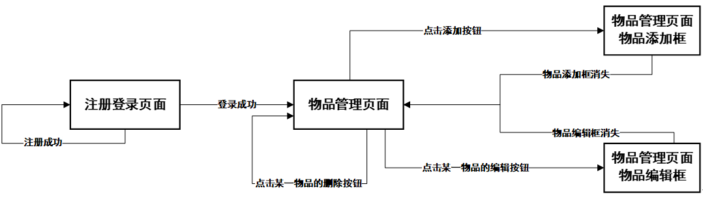

# 奇异果物品管理平台

**Author**: Casey Lee​ :kiwi_fruit:

---

## 数据库连接

在 `src\util\DbcpPool.java` 修改对应数据

```java
pro.setProperty("url", "jdbc:mysql://localhost:3306/数据库名?useUnicode=true&characterEncoding=UTF-8");
pro.setProperty("username", "xxx");
pro.setProperty("password", "xxx");
```

## 系统分层

| 层次             | 包                  | 描述                                           |
| ---------------- | ------------------- | ---------------------------------------------- |
| domain（域模型） | com.me.domain       | 存放JavaBean，即是课上提及过的VO、POJO。       |
| DAO              | com.me.dao          | 数据访问接口                                   |
|                  | com.me.dao.impl     | 数据访问接口的实现类，存取数据库的代码均在此处 |
| Service          | com.me.service      | 业务接口                                       |
|                  | com.me.service.impl | 业务接口的实现类                               |
| Controller       | com.me.controller   | 控制器                                         |
| Web（表现层）    | com.me.web.filter   | 过滤器                                         |
|                  | com.me.util         | 通用工具，存放数据库连接池                     |
|                  | com.me.factory      | 存放Service工厂和DAO工厂                       |
|                  | com.me.exception    | 存放自定义异常                                 |

## 网站图



## UML 类图

### 1. 用户注册功能


### 2. 用户登录功能


### 3. 物品查看功能


### 4. 物品添加功能


### 5. 物品删除功能


### 6. 物品编辑功能


## 感想

然样式是copy别人的，但也算是第一次做全栈，我有许多新奇的体验。

遇到的一些问题及解决方案：

### 1. 编辑功能的物品名的绑定与显示

#### 绑定


这样就识别到了，我点击了五羊甜筒的编辑按钮。实现了物品名和按钮的绑定

#### 显示

因我的设计问题，商品的名字作为 id 的主键，那么物品名应该是不可被编辑的

错误示范：


我们第 1 步，已经能够获得商品的 gs_name 了，那么我们在这里，就可以直接利用这个 gs_name, 将 他直接 set 到表单里。


- 将表单改为 post，将 name 的输入框的 type 属性改为 hidden （这个称为表单隐藏域）
- 此时name被隐藏了，加一个提示，：“您正在编辑 ”+ 物品名
- 通过 js 直接将刚才得到的 gs_name set 到表单中的隐藏域


### 2. 登录跳到servlet的时候密码可以在url看见

改post提交解决了。

### 3. SmartUpload和物品其他属性提交时乱码

我这里使用混合表单同时将文件和 text 提交。文件上传用 SmartUpload。


但是text 含有中文字符提交后是乱码，调试后发现 SmartUpload.getRequest().getParameter(“gs_name”) 已经乱码，上网查找后发现 **SmartUpload 的 Request 的 CharacterEncoding编码方式都是UTF-8**。

编码一般都是从 iso-8859-1 开始的。

**解决方法**：

1. 使用new String(str.getBytes("ISO-8859-1"),"UTF-8") 对中文字符转换。但这个方法有点麻烦

2. 同时我又找到了一个 jar 包（应该是非英语国家的人写的）。已经被修改好的编码转换方式。直接替代之前那个即可。

